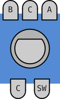

Class OpenFSBRotaryEncoder
==========================

The OpenFSBRotaryEncoder handles the pin input of a quadrature incremental rotary encoder. The input is debounced. OpenFSBRotaryEncoder has two options to get the direction: check if the direction is clockwise or counterclockwise or get a counter.

Methods for checking direction:

 * getDirection
 * rotatingCW
 * rotatingCCW

Method for getting the counter:

 * read();

A rotary encoder has two outputs to check the direction the rotary encoder is turned: A and B. ``pinA`` and ``pinB`` contain the pin numbers the rotary encoder outputs are connected to. When the rotary encoder includes a switch, the switch can be handled by the `OpenFSBButton <OpenFSBButton.html>`_ class.

This picture shows the rotary encoder outputs. With some rotary encoders the outputs A and B are swapped. The common pins C are connected to GND or Vcc depending on the use of pullup or pulldown resistors.

Constructor
-----------
OpenFSBRotaryEncoder( pinA, pinB )
 Create OpenFSBRotaryEncoder instance with only the mandatory argument ``pin``.
 
 .. function:: OpenFSBRotaryEncoder::OpenFSBRotaryEncoder( uint8_t pinA, uint8_t pinB )

 Arguments:
 
 * pinA: Pin number of pin A. See the board/MCU specifications for the pin numbers.
 * pinB: Pin number of pin B. See the board/MCU specifications for the pin numbers.

 Defaults:
 
 * mode: ``PULLUP``
 * onState: ``LOW``

 Example:
 
 .. code-block:: c

    OpenFSBRotaryEncoder debouncer( 7, 8 );

OpenFSBRotaryEncoder( pinA, pinB, mode )
 Create OpenFSBRotaryEncoder instance with custom ``mode``.
 
 .. function:: OpenFSBRotaryEncoder::OpenFSBRotaryEncoder( uint8_t pinA, uint8_t pinB, uint8_t mode )

 Arguments:
 
 * pinA: Pin number of pin A. See the board/MCU specifications for the pin numbers.
 * pinB: Pin number of pin B. See the board/MCU specifications for the pin numbers.
 * mode: ``PULLUP`` or ``PULLDOWN``. ``EXTERNAL`` is also posible here. In that case ``onState`` is left default (``LOW``). Best way is to specity the onState explicitely when mode is ``EXTERNAL``.

 Defaults:
 
 * onState: ``LOW`` when mode is ``PULLUP`` or ``EXTERNAL``, ``HIGH`` when mode is ``PULLDOWN``

 Example:
 
 .. code-block:: c

    OpenFSBRotaryEncoder debouncer( 7, 8, PULLUP );

OpenFSBRotaryEncoder( pinA, pinB, mode, onState )
 Create OpenFSBRotaryEncoder instance with custom ``mode`` and ``onState``.
 
 .. function:: OpenFSBRotaryEncoder::OpenFSBRotaryEncoder( uint8_t pinA, uint8_t pinB, uint8_t mode, uint8_t onState )

 Arguments:
 
 * pinA: Pin number of pin A. See the board/MCU specifications for the pin numbers.
 * pinB: Pin number of pin B. See the board/MCU specifications for the pin numbers.
 * mode: ``EXTERNAL``. ``PULLUP`` and ``PULLDOWN`` are also possible here, but in that case the value of the onState parameter is ignored and onState will be set automatically according to the mode.
 * onState: the `on` state value ``LOW`` or ``HIGH`` (ignored when mode is ``PULLUP`` or ``PULLDOWN``) 

 Defaults:
 
 * onState: ``LOW`` when mode is ``PULLUP``, ``HIGH`` when mode is ``PULLDOWN``
 
 Example:
 
 .. code-block:: c

    OpenFSBRotaryEncoder debouncer( 7, 8, EXTERNAL, LOW );

Methods
-------

getOnState()
 Get the actual `on` state value.

 .. function:: uint8_t OpenFSBRotaryEncoder::getOnState()

 Returns: the actual `on` state value ``LOW`` or ``HIGH``.
 
 Example:
 
 .. code-block:: c

     uint8_t val = encoder.getOnState();

setIntervalMS( intervalMS )
 Set or change the stable interval time.

 .. function:: void OpenFSBRotaryEncoder::setIntervalMS( uint16_t intervalMS )

 Arguments:
 
 * intervalMS: the stable interval time in milliseconds.

 Example:
 
 .. code-block:: c

     encoder.setIntervalMS( 3 );

 .. note::
   
   The stable interval time is different from some other solutions. This stable interval time is the time to detect the control is not debouncing anymore and starts after the last bounce. Therefore this time should be quite short.

getIntervalMS()
 Get the stable interval time.

 .. function:: uint16_t OpenFSBRotaryEncoder::getIntervalMS()

 Returns: the stable interval time in milliseconds.

 Example:
 
 .. code-block:: c

     uint16_t val = encoder.getIntervalMS();

getDirection()
 Tells which direction the rotary encoder is turned.

 .. function:: int OpenFSBRotaryEncoder::getDirection()

 Returns: 1 if turned clockwise, -1 if turned counterclockwise, 0 if not turned

 Example:
 
 .. code-block:: c

     int val = encoder.getDirection();

rotatingCW()
 Tells if the rotary encoder is turned clockwise. Shortcut of getDirection() == 1.

 .. function:: bool OpenFSBRotaryEncoder::rotatingCW()

 Returns: ``true`` or ``false``

 Example:
 
 .. code-block:: c

     bool val = encoder.rotatingCW();

rotatingCCW()
 Tells if the rotary encoder is turned counterclockwise. Shortcut of getDirection() == -1.

 .. function:: bool OpenFSBRotaryEncoder::rotatingCCW()

 Returns: ``true`` or ``false``

 Example:
 
 .. code-block:: c

     bool val = encoder.rotatingCCW();

update()
 Updates the state. This methods should be called before checking the new state. Best way is to include the update in the loop.

 .. function:: void OpenFSBRotaryEncoder::update()

 Example:
 
 .. code-block:: c

     encoder.update();

read()
 Updates the state of the rotary encoder and returns a new counter value.

 .. function:: long OpenFSBRotaryEncoder::read()

 Returns: new counter

 Example:
 
 .. code-block:: c

     long val encoder.read();

Error detection and correction
------------------------------
OpenFSBRotaryEncoder has automatic error detection and correction. When a pulse is missed the readings are incomplete when reaching the next detent. The result is ignored then. In the rare case, possible with extreme high rotation speed, multiple missed pulses may cause an opposite direction result. The next detent the error is cleared and the result will give the right direction again. At extreme high rotation speed the error rate is max 2 per cent. Under normal conditions of use the error rate is max 1 per mille. Both are measured with low cost rotary encoders. Better rotary encoders will give even better results.

Usage
-----

Using direction
^^^^^^^^^^^^^^^
Using methods rotatingCW and rotatingCCW:

 .. code-block:: c

    #include <OpenFSBRotaryEncoder.h>

    #define ENCODER_PIN_A   2
    #define ENCODER_PIN_B   3

    OpenFSBRotaryEncoder encoder( ENCODER_PIN_A, ENCODER_PIN_B );  // Defaults: mode=PULLUP, onState=LOW

    void setup() {
	  Serial.begin( 115200 );
    }

    void loop() {
      encoder.update();
      if ( encoder.rotatingCW() ) {
        Serial.println( "Turned clockwise" );
      }
      if ( encoder.rotatingCCW() ) {
        Serial.println( "Turned counterclockwise" );
      }
    }

Using method getDirection:

 .. code-block:: c

    #include <OpenFSBRotaryEncoder.h>

    #define ENCODER_PIN_A   2
    #define ENCODER_PIN_B   3

    OpenFSBRotaryEncoder encoder( ENCODER_PIN_A, ENCODER_PIN_B );  // Defaults: mode=PULLUP, onState=LOW

    void setup() {
	  Serial.begin( 115200 );
    }

    void loop() {
      encoder.update();
      if ( encoder.getDirection() == 1 ) {
        Serial.println( "Turned clockwise" );
      }
      if ( encoder.getDirection() == -1 ) {
        Serial.println( "Turned counterclockwise" );
      }
    }

Using counter
^^^^^^^^^^^^^

 .. code-block:: c

    #include <OpenFSBRotaryEncoder.h>

    #define ENCODER_PIN_A   2
    #define ENCODER_PIN_B   3

    OpenFSBRotaryEncoder encoder( ENCODER_PIN_A, ENCODER_PIN_B );  // Defaults: mode=PULLUP, onState=LOW
	
    long lastCounter = 0;

    void setup() {
	  Serial.begin( 115200 );
    }

    void loop() {
      int counter = encoder.read();
      if ( counter > lastCounter ) {
        lastCounter = counter;
        Serial.println( "Turned clockwise" );
      }
      if ( counter < lastCounter ) {
        lastCounter = counter;
        Serial.println( "Turned counterclockwise" );
      }
    }

